

# 🤖 InterviewAI

**AI-Powered Online Interview System with Real-Time Cheating Detection, Voice Input & Automated Scoring**

---

## 📖 About

InterviewAI is a production-grade full-stack web application that completely automates the technical interview process. Companies post job descriptions, and the AI system analyzes the JD using **LLaMA3-70B** to extract interview topics with difficulty levels and weightages, then conducts real conversations through **Alex**, the AI interviewer, who asks dynamic follow-up questions based on candidate responses. The system monitors for cheating in real-time using **face detection** (face-api.js), **tab-switch alerts**, **copy-paste detection**, and **AI-generated answer detection**. Every answer is scored across 4 dimensions — Technical Accuracy (40%), Relevance (25%), Clarity (20%), Depth (15%) — and detailed reports are generated with strengths, weaknesses, hiring recommendations, and percentile rankings. The system also provides **unlimited mock interview practice** for candidates — helping students and job seekers prepare with instant AI feedback on every answer.

---

## 📸 Screenshots

### 🏠 Landing Page

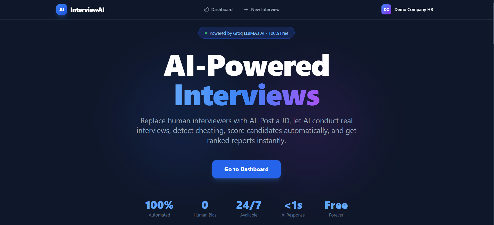

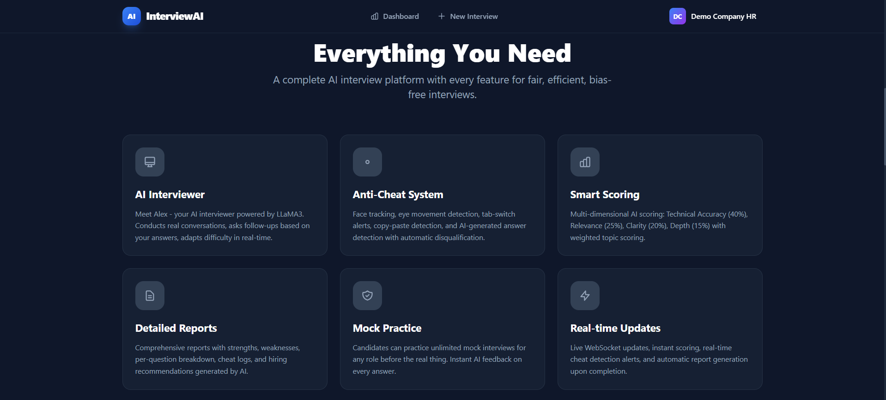

### 🔐 Authentication

| Login | Register |
|-------|----------|
| 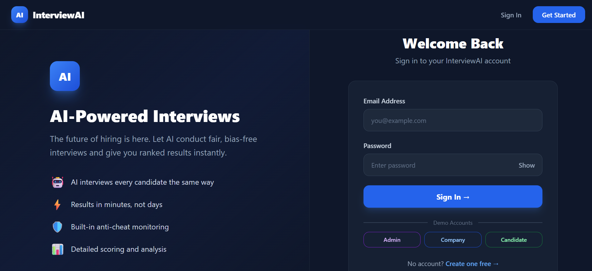 | 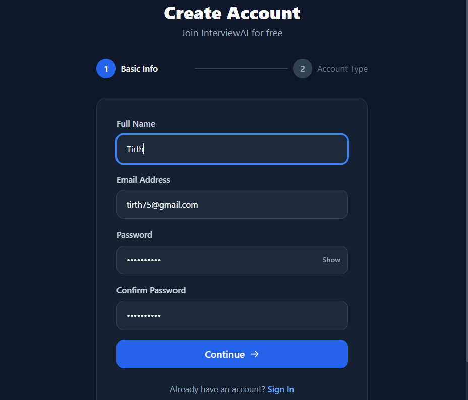 |

| Register - Company Details |
|---------------------------|
| 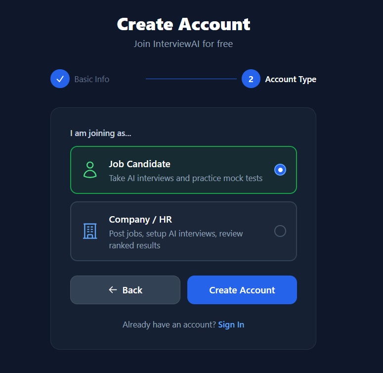 |

### 🏢 Company Dashboard

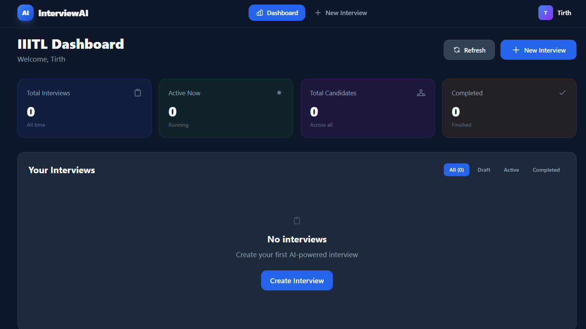

### 📝 Interview Creation

| Create Interview | AI Topic Generation |
|-----------------|---------------------|
| 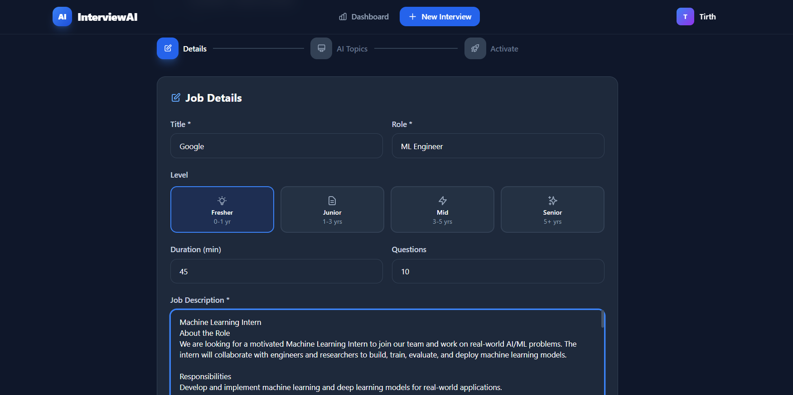 | 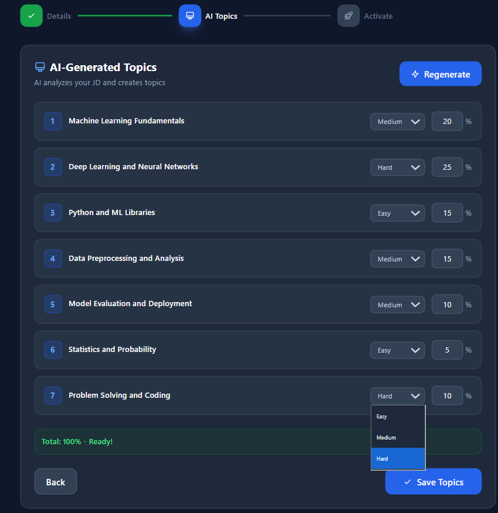 |

### 📧 Invite Candidates

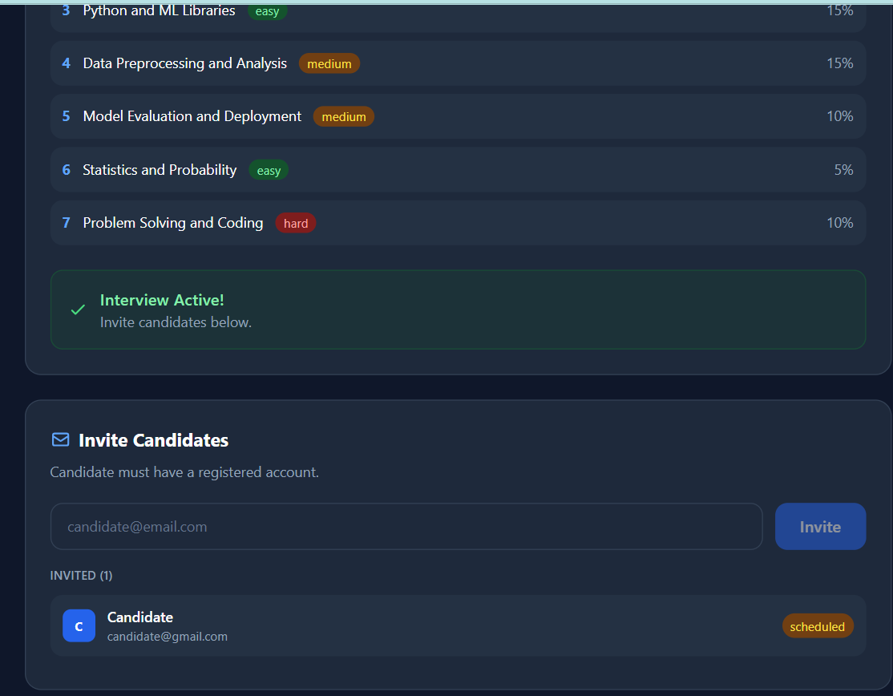

### 👤 Candidate Dashboard

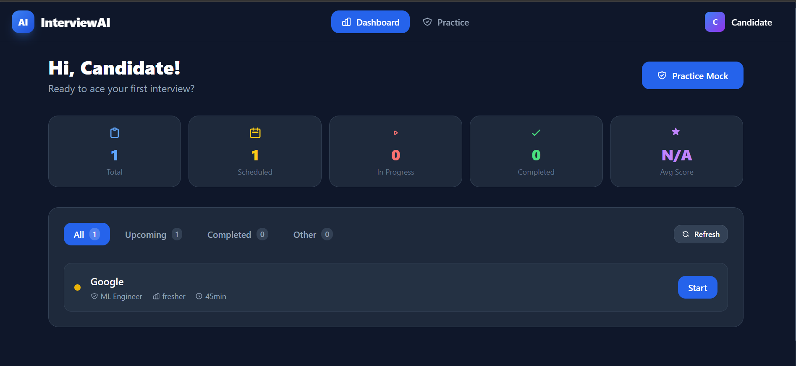

### 💻 Interview Room

| Rules & Camera Permission | Live Interview |
|--------------------------|----------------|
| 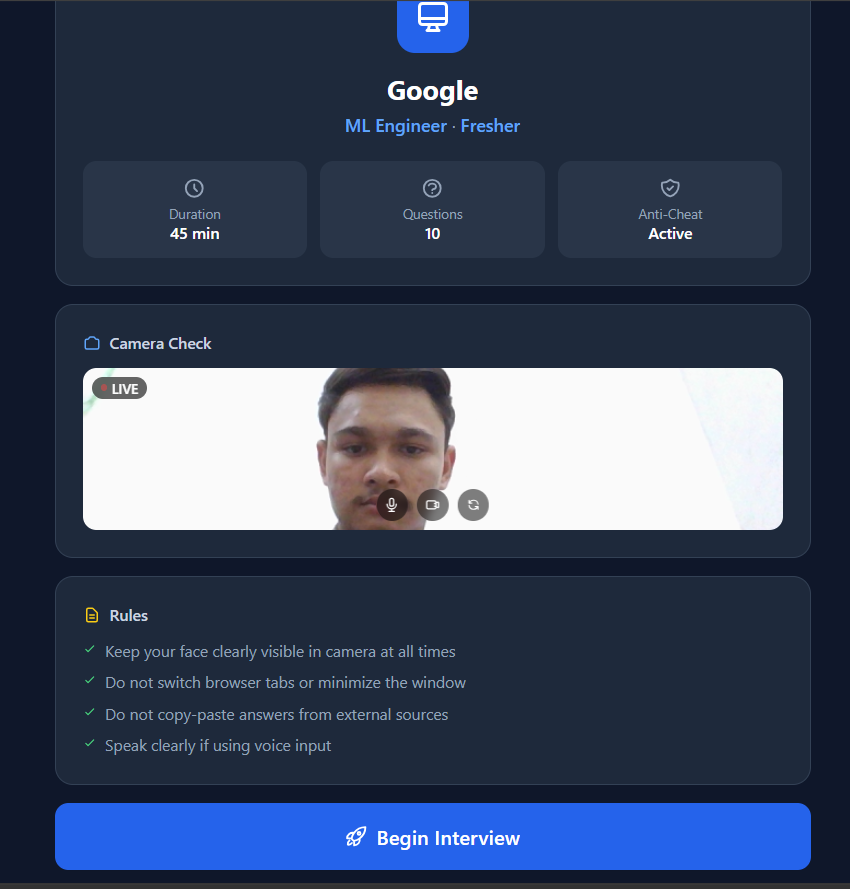 | 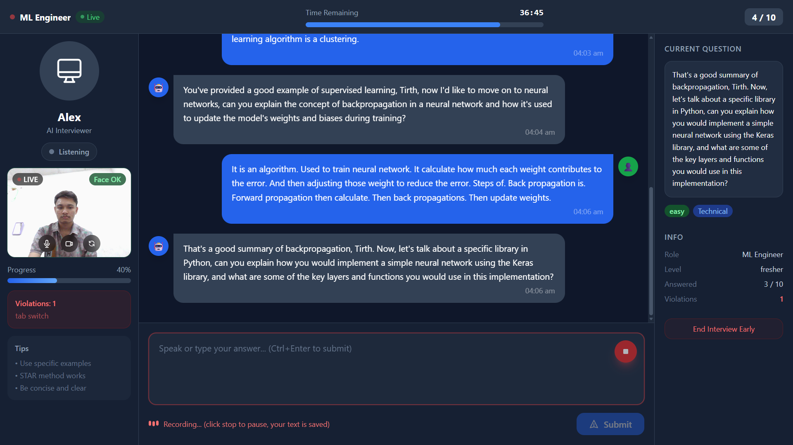 |

### 📊 Results & AI Report

| Interview Results | AI-Generated Report |
|------------------|---------------------|
| 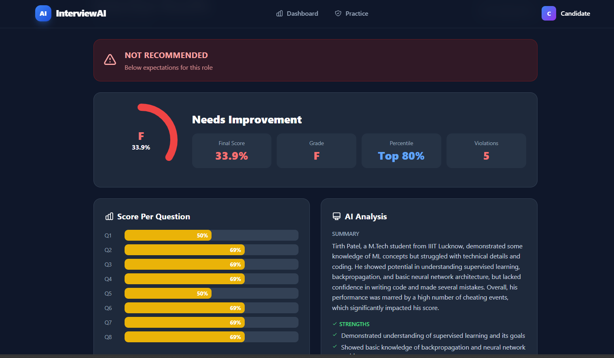 | 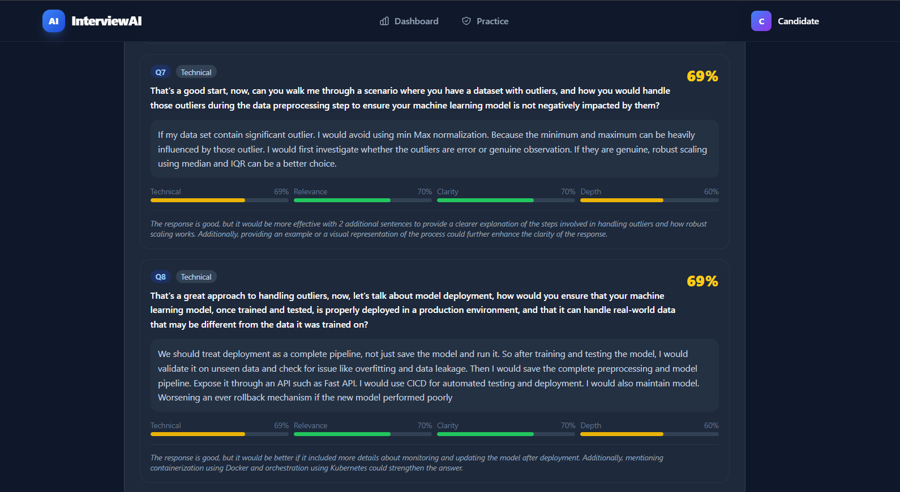 |

---

## 🛠️ Tech Stack

### Backend

| Technology | Purpose |
|-----------|---------|
| **Python 3.12** | Core language |
| **Flask 3.0** | Web framework |
| **Flask-SocketIO** | Real-time WebSocket communication |
| **Flask-JWT-Extended** | JWT authentication & role-based access |
| **Flask-SQLAlchemy** | ORM for database operations |
| **SQLite** | Zero-config database |
| **Groq API** | LLM inference (LLaMA3-70B, free tier) |
| **scikit-learn** | TF-IDF based plagiarism detection |
| **sentence-transformers** | Semantic similarity for answer comparison |
| **eventlet** | Async WebSocket support |

### Frontend

| Technology | Purpose |
|-----------|---------|
| **React 18** | UI framework |
| **Vite 5** | Build tool with fast HMR |
| **Tailwind CSS 3.4** | Utility-first styling |
| **Socket.IO Client** | Real-time WebSocket updates |
| **face-api.js** | Real-time face detection & tracking |
| **Web Speech API** | Browser-native speech-to-text (free) |
| **SpeechSynthesis API** | AI voice output (text-to-speech) |
| **Recharts** | Score visualization charts |
| **React Router v6** | Client-side routing |
| **Axios** | HTTP client with interceptors |
| **React Hot Toast** | Toast notifications |

### AI & ML

| Technology | Purpose |
|-----------|---------|
| **Groq Cloud** | Fastest free LLM inference API |
| **LLaMA3-70B-Versatile** | Question generation, answer evaluation, reports |
| **face-api.js (TinyFaceDetector)** | Real-time browser face detection |
| **Web Speech API** | Free speech-to-text conversion |
| **SpeechSynthesis** | AI interviewer voice output |
| **TF-IDF + Cosine Similarity** | Answer plagiarism detection |

---

## ✨ Features

<table>
<tr>
<td width="50%">

### 🤖 AI Interviewer (Alex)
- Powered by **Groq LLaMA3-70B** (most powerful free model)
- Natural, human-like conversation flow
- Dynamic follow-up questions based on candidate answers
- Adapts difficulty based on performance
- Personalized questions from uploaded resume
- Full interview flow: Intro → Technical → Behavioral → Closing
- AI voice output using SpeechSynthesis API

</td>
<td width="50%">

### 🛡️ Anti-Cheat System (10 Detection Types)
- **Face not detected** → HIGH severity (5s threshold)
- **Multiple faces** → CRITICAL severity (instant alert)
- **Looking away** → MEDIUM severity (face at edge)
- **Tab switch / window blur** → HIGH severity
- **Copy-paste detection** → MEDIUM severity
- **AI-generated answer detection** → CRITICAL
- **Fast answer timing** → suspicious flag
- **Right-click blocking** → LOW severity
- **Camera stopped** → HIGH severity
- **Auto-disqualification** at 70% cheat score

</td>
</tr>
<tr>
<td>

### 📊 Smart Scoring Engine
- **4-dimension scoring**: Technical (40%), Relevance (25%), Clarity (20%), Depth (15%)
- Weighted scoring by topic importance (configurable)
- Automatic cheat penalty deductions
- Percentile ranking among all candidates
- Grade system: A+, A, B+, B, C, F
- Hire recommendation: Strongly Recommend / Recommend / Neutral / Not Recommend
- Per-question AI feedback with improvement suggestions

</td>
<td>

### 🎙️ Voice Input System
- **Web Speech API** — free, browser native, zero setup
- Real-time speech-to-text transcription
- **Append mode** — pause and resume without losing text
- Interim results shown live as you speak
- Keyboard fallback for unsupported browsers
- Word count display and Ctrl+Enter to submit
- Clear All button to reset

</td>
</tr>
<tr>
<td>

### 🏢 Company Portal
- Create interviews with full job descriptions
- AI auto-generates interview topics from JD analysis
- Review, edit topic names, weightages, and difficulty
- One-click interview activation
- Invite candidates by email with unique session tokens
- Real-time candidate progress tracking via WebSocket
- View ranked results with scores and grades
- Download AI-generated detailed reports

</td>
<td>

### 👤 Candidate Portal
- View assigned interview invitations
- Start and resume interviews seamlessly
- **Mock interview practice** — unlimited, instant feedback
- 12+ popular roles to practice (SE, Frontend, Backend, ML, etc.)
- Upload resume for personalized AI questions
- View detailed score breakdown per question
- Q&A review with AI feedback on every answer
- Grade, percentile, and hire recommendation

</td>
</tr>
<tr>
<td>

### 📄 AI Report Generation
- **Strengths analysis** — top 3 identified by AI
- **Weaknesses analysis** — areas for improvement
- **Detailed analysis** — 5-6 sentence comprehensive review
- **Hiring recommendation** with confidence level
- Per-question score bars with 4 dimensions
- Cheat violation log with timestamps and severity
- Auto-generated on interview completion
- Manual regeneration option

</td>
<td>

### 👑 Admin Dashboard
- System-wide statistics overview
- Total users, companies, candidates count
- Active interviews and session monitoring
- User management — activate/deactivate accounts
- Role-based filtering (admin/company/candidate)
- All interviews list with company names
- Cheat event counters
- Completion rate and system health metrics

</td>
</tr>
<tr>
<td>

### 📷 Camera & Face Detection
- Real-time camera preview with mirror effect
- face-api.js TinyFaceDetector model
- Face OK / No Face / Multiple Faces indicators
- Video border color changes (green/red/orange)
- Camera retry with progressive constraint loosening
- Auto-reconnect on camera disconnect
- Proper camera stop on interview end
- Mute/unmute microphone toggle
- Show/hide camera toggle

</td>
<td>

### ⚡ Real-Time Features
- WebSocket-based live updates (Flask-SocketIO)
- Real-time cheat event notifications
- Live candidate progress tracking for companies
- Instant interview invitation notifications
- Timer with color-coded warnings (5min/1min)
- Auto-submit on time expiry
- Session heartbeat monitoring
- Typing/thinking indicators for AI responses

</td>
</tr>
</table>

---

**Built with ❤️ using Groq LLaMA3, React, Flask, and SQLite**

*100% Free · 100% Open Source · Zero Paid API Dependencies*

